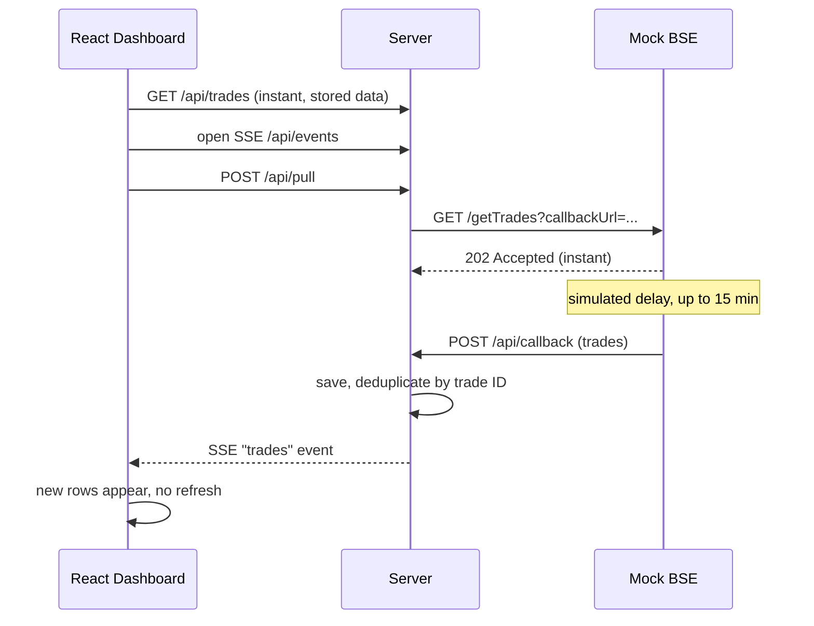

# Architecture

## The problem
A full pull takes up to 15 minutes, but any HTTP connection open for more than 30 seconds is killed.

## Design
1. **Never hold a connection open.** The BSE call returns 202 immediately and delivers the data later by calling back, so no request lasts more than a moment.
2. **Store results on our side.** The dashboard reads from our store, so it opens instantly even during a pull.
3. **Push, don't poll.** The server sends new trades over Server-Sent Events. No polling loop and no cron.

## Why SSE
Updates only flow server to browser, so SSE is enough. It's simpler than WebSockets and reconnects automatically.

## Decisions and trade-offs
- Trades are deduplicated by trade ID, so repeated deliveries are safe.
- A flag blocks overlapping pulls.
- In-memory storage keeps the demo simple. In production I'd use a database.
- Assumption: the real BSE API supports an async or callback pattern. If it only offers a long synchronous response, the pull would need a dedicated worker with a long-lived connection outside the 30s network.